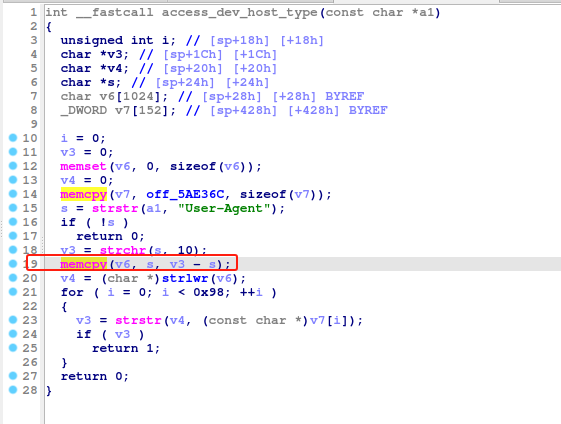

# Tenda W18E access_dev_host_type
### Overview
vendor: Tenda

product: W18E

version: V16.01.0.13(3742)

type: Stack Overflow
### Vulnerability Description
Tenda W18E V16.01.0.13(3742) were discovered to contain a stack overflow in the access_dev_host_type function.This device has an unauthorized RCE vulnerability. Attackers can obtain root privileges without logging in.
### Vulnerability details
In function access_dev_host_type line 15、19, it reads in a user-provided parameter `User-Agent`, and the variable `s` is passed to the `memcpy` function without any length check, which may overflow the stack-based buffer `v6`. As a result, by requesting the page, an attacker can easily execute a denial of service attack or remote code execution.



### POC
```python
import requests
ip = '192.168.0.1'
url = f'http://{ip}/'
payload = {
    "User-Agent": 'a' * 2000
}

res = requests.post(url=url, data=payload)
print(res.content)
```
